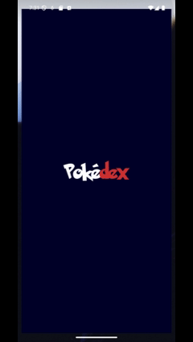

#  Pokedex

App de estudo em desenvolvimento criado com Flutter usando arquitetura modular, cache local, paginação e integração com a PokéAPI [PokéAPI](https://https://pokeapi.co/).

## ✨ Funcionalidades

- 🔍 Busca por nome ou ID com delay de 1 segundo após o último caracter digitado
- 🎯 Filtragem da lista por tipo de Pokémon e/ou ordenação
- ⬇️ Scroll infinito com carregamento incremental a cada 20 Pokémons
- 📦 Cache de dados local para evitar requisições excessivas
- 🔄 Requisições automáticas para detalhes (imagem e tipos) quando não estiver salvo em cache


## 🧱 Arquitetura do Projeto
O projeto segue uma estrutura modular baseada em MVC por feature, promovendo reutilização, organização e escalabilidade.

```
lib/
├── core/                      # Recursos centrais e globais do app
│   ├── auth/                  # Lógica de autenticação geral
│   ├── cache/                 # Implementações de cache local
│   ├── config/                # Configurações globais, constantes
│   ├── dependency_injection/  # Setup do get_it/injectable
│   ├── routes/                # Gerenciamento de rotas
│   └── theme/                 # Definições de tema, cores, fontes
│
├── features/                  # Módulos por funcionalidade
│   ├── auth/                  # Feature: autenticação
│   ├── favorites/             # Feature: pokémons favoritos
│   ├── home/                  # Feature principal: Home da Pokédex
│   │   ├── controllers/       # Controllers MobX da feature
│   │   ├── models/            # Modelos (entidades) da feature
│   │   ├── repositories/      # Repositórios com acesso a dados da feature
│   │   ├── screens/           # Telas principais da feature
│   │   ├── services/          # Regras de negócio auxiliares feature
│   │   └── widgets/           # Componentes reutilizáveis da feature
│   ├── onboarding/            # Feature: telas de boas-vindas
│   ├── pokemon_details/       # Feature: detalhes do Pokémon
│   ├── profile/               # Feature: perfil do usuário
│   ├── region/                # Feature: regiões dos Pokémons
│   ├── splash/                # Feature: splash screen
│
├── shared/                    # Elementos globais reutilizáveis
│   ├── layout/                # Layouts base para telas
│   └── utils/                 # Funções auxiliares e helpers
│       ├── color/             # Helpers de cores
│       ├── helper/            # Funções utilitárias gerais
│       ├── pokemons/          # Helpers específicos dos pokémons
│       └── text/              # Constantes e manipulação de texto
│
├── widgets/                   # Componentes globais e genéricos
│   ├── appbar/                # AppBars customizadas
│   ├── buttons/               # Botões genéricos
│   ├── status_widgets/        # Widgets de loading, erro etc.
│   └── textfields/            # Campos de texto personalizados

```

## 🚀 Tecnologias Utilizadas

- **Flutter** com `Dart`
- **MobX** para gerenciamento de estado
- **Dio** para requisições HTTP
- **GetIt** + **Injectable** para injeção de dependência
- **Hive** para persistência local (cache)
- **GoRouter** para navegação
- **PokéAPI** como fonte de dados

## 🧠 Principais Lógicas

- 🔄 A API principal (https://pokeapi.co/api/v2/pokemon) é requisitada apenas uma vez ao iniciar o app, para cache local.
- 📥 Detalhes como imagem e tipo são baixados da API somente quando exibidos ou pesquisados, se não estiverem no cache.
- 🧠 A busca é feita com delay de digitação para evitar chamadas em excesso.
- 📱 O carregamento incremental é controlado com ScrollController + variavel de carregamento.


## 📦 Instalação e Execução

Para rodar esse projeto, certifique-se de ter os seguintes requisitos instalados:
- Flutter SDK: `3.32.0`
- Dart SDK: `3.8.0`
- Android NDK: `27+`
    > ℹ️ Dica: configure o `ndk.version` no arquivo `android/app/build_gradle.kts` caso enfrente erros ao compilar para Android.

Clone o repositório:
```bash
git clone https://github.com/luthianopacheco/pokedex-flutter.git
cd pokedex
```

Instale os pacotes:
```bash
flutter pub get
```

Execute o app:
```bash
flutter run
```

## ✍🏼 To-Do
 ✅ Splash Screen com animação

 ✅ Telas de Onboarding

 ✅ Buscar Pokémon com delay de digitação

 ✅ Paginação ao rolar

 ✅ Cache dos pokémons

 ✅ Filtros por tipo e ordem

 ⬜ Tela de detalhes do Pokémon

 ⬜ Aba de Regiões

 ⬜ Aba de Favoritos

 ⬜ Aba de Perfil

 ⬜ Autenticação
 
 ⬜ Hospedagem HTTP

 ⬜ Persistência na nuvem

 ⬜ Notificações push

 ⬜ Tema escuro

 ⬜ Layout próprio para Desktop Web e Tablet


## 📸 Prints



## 🧑‍💻 Autor
Desenvolvido por: Luthiano Pacheco

- 💼 [LinkedIn](https://www.linkedin.com/in/luthiano-pacheco/)
- 📩 [E-mail](mailto:luthianopacheco@gmail.com)

## 🎨 Design
Design inspirado no projeto figma: [Pokédex / Pokémon App](https://www.figma.com/community/file/1202971127473077147) de <i>Junior Saraiva</i>


